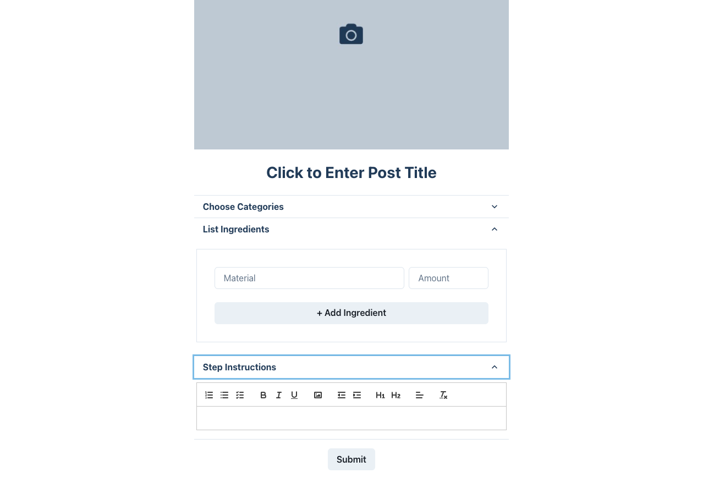
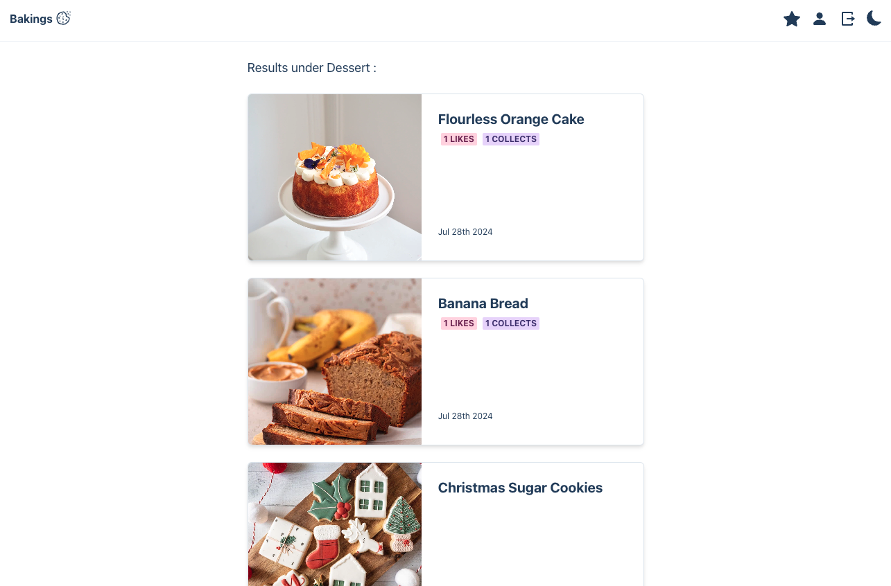

# Recipe Sharing Platform

## Description

Bakings is a recipe sharing network encourages healthy lifestyle and hobby, providing practical knowledge and a platform for users to record and share. Users can share their posts, react to friends’ posts, and create a friend list. This MERN stack application uses **React** for the front end, **GraphQL** and Express.js for server, **MongoDB** and the Mongoose ODM for the database.

## Table of Contents

- [Features](#features)
- [Usage](#usage)
- [Review](#review)

## Features

- [JWT](https://www.npmjs.com/package/jsonwebtoken)
- [Chakra UI](https://v2.chakra-ui.com/)
- [ReactQuill](https://www.npmjs.com/package/react-quill)

## Usage

The application accepts and responds to user input, uses queries and mutations for retrieving, adding, updating, and deleting data.

## Mock-Up

The following image shows the web application's appearance and functionality:

## Review

- The URL of the deployed application: https://bakings.onrender.com/

- The URL of the GitHub repository:https://github.com/Saraz-Git/bakings
